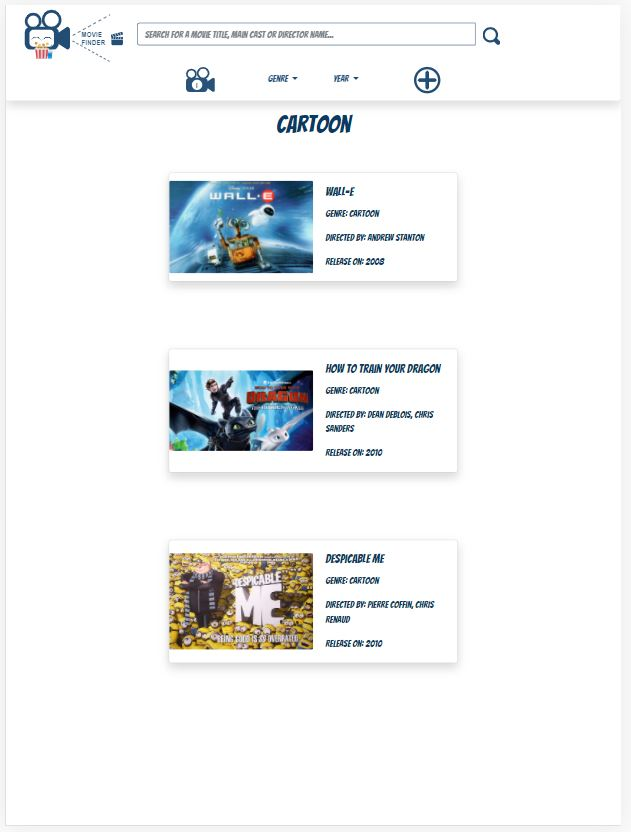
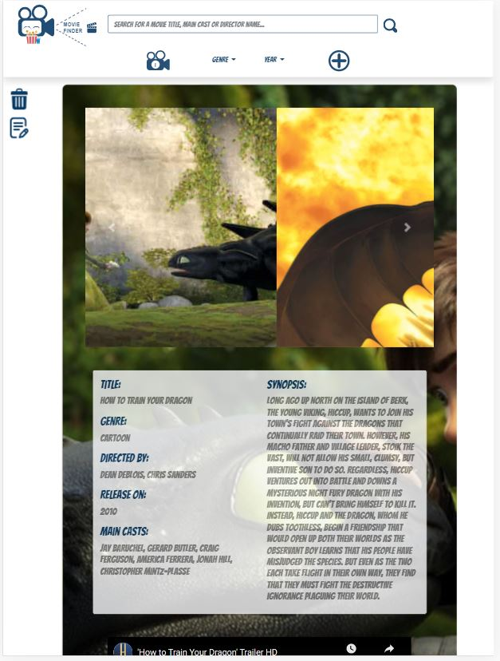
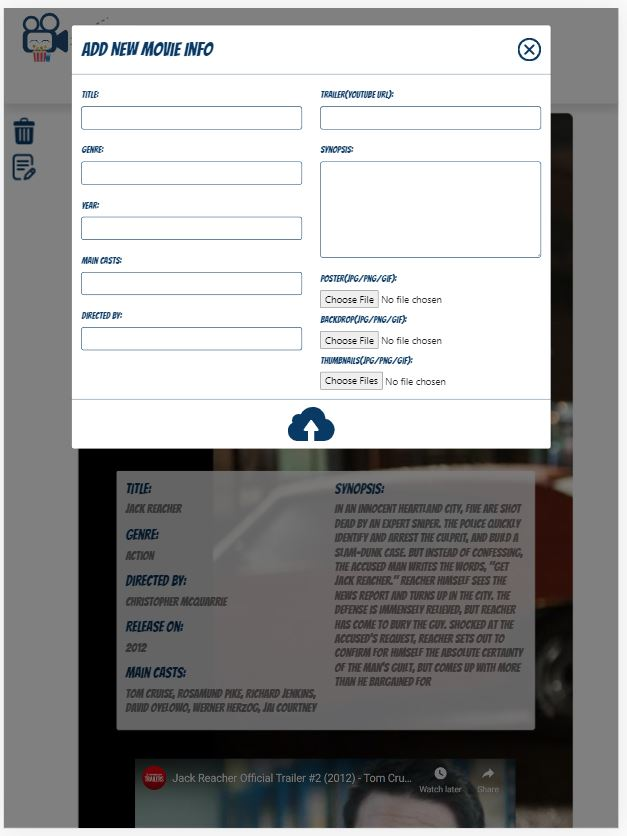
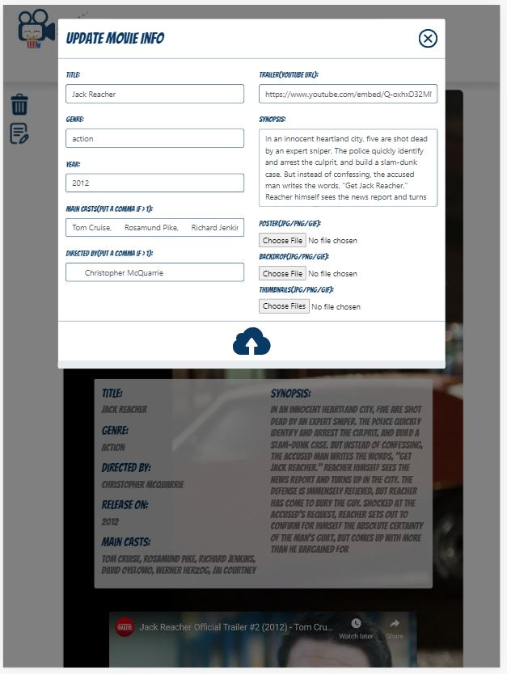
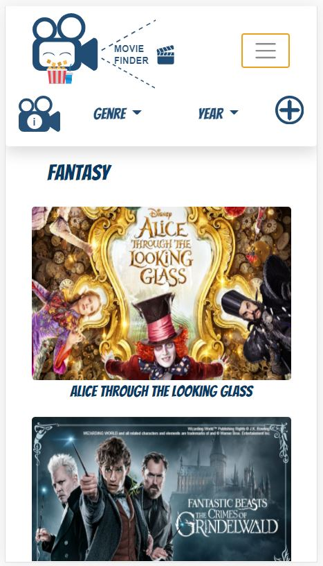
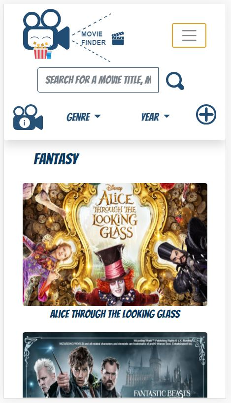
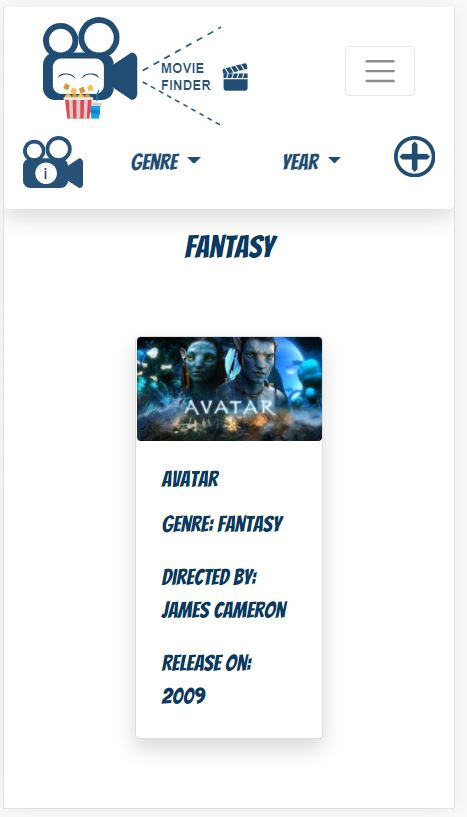
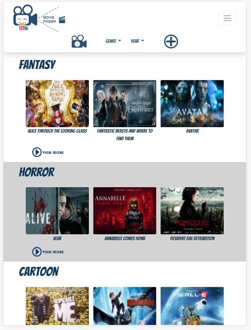
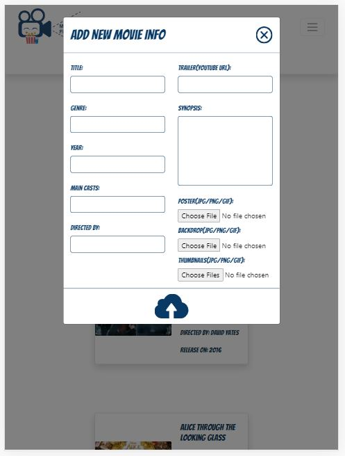

# Milestone Project 3 Data Centric - MovieFinder
<br/>
Fig 1 - Landing page of MovieFinder <br/>


## Problem Statement

- Many people woring at home start to exercise at home such as high intensive individual training (HIIIT)
- Need know what exercise at home set can be used for HIIIT
- Share information of effective HIIT or individual exercise set
- Video sharing of each set
- Record of weight loss by weeks or months
- Ranking system for favourite set
- Allow comments
- Membership signup

<br/>

## UX
Realization of this project depends on the availability of users and technologies. Users would be public bus commuters or individual who has lost his/her way at some unfamiliar places. This application should fulfill their following needs:

- "I want to find the nearest bus stop from my location within a walkable distance."
- "I want to find the bus stop which I need to alight."
- "I want to find a particular bus stop."
- "I want to know where is the bus now."
- "I want to know my current location."
- "I want to know when is the bus going to arrival."
- "I want to know what are the bus services available at the bus stop."
- "I want to know the name of the street or road or bus stop code."

By using front-end and back-end technologies such as bootstrap,  restful api, the user's needs can be achieved. This application would present a landing page of a singapore map with clickable buttons and text boxes for user's inputs. It would provides user on the location of the bus, bus stop and user, as well as real-time information of a bus stop and bus.  A wireframe of this application can be found [here](https://xd.adobe.com/view/fbc25fb5-8cc7-4cdf-afc6-19bc692072b8-ae91/).

## Features
### Existing Features
- ***Movie Info Search Bar*** - This feature allow user to search for different number of movies in the movie database that are related to the queried content.
<br/>
  


- ***Top Bar Buttons*** - (From left to right) The "i" classic movie film recorder button directs the user back to the landing page. 
The genre dropdown menu displays a range of available genre and if selected, it directs the user to the movie info list of the selected genre.
The year dropdown menu displays a range of available year and if selected, it directs the user to the movie info list of the selected year
 <br/>
  <br/>

- ***Movie Genre View More Button*** - THe view more button directs the user to the list of movie info filter by genre page.
<br/>
  <br/>  


- ***Movie Info Page Side Bar Button*** - (From top to bottom) The waste bin icon directs the user to the delete popout. The edit icon directs the user to the update popout.
<br/>
  <br/>

 - ***Movie Info List*** - The movie info list displays a list of fitered movies.
<br/>
  <br/>

- ***Movie Info Page*** - The movie info page displays the information of a selected movie.
<br/>

  <br/>

- ***Add New Movie Popout*** - The add new movie popout allows user to add a new movie information into the database. It is enhanced with a validation feature to prevent invalid
info to be uploaded into the database. Partial of the validation script is as shown below:
<br/>

  <br/>

  ```
  # To check whether field is empty
    if len(imageurl.filename) == 0:
        errors['file_is_blank'] = "Poster field cannot be blank"
    elif '.' in imageurl.filename:
        file_ext = os.path.splitext(imageurl.filename)[1]
        # To validate file extension
        if file_ext not in app.config['UPLOAD_EXTENSIONS']:
            errors['poster_ext_is_wrong'] = "Poster file ext is invalid"
    # To validate file size
    elif poster_size > 1024 * 1024:
        errors['poster_size_above_limit'] = "Poster file size cannot be  more than 1MB"

    # To check whether field is empty
    if len(backdrop.filename) == 0:
        errors['backdrop_is_blank'] = "Backdrop field cannot be blank"
    elif '.' in backdrop.filename:
        file_ext = os.path.splitext(backdrop.filename)[1]
        # To validate file extension
        if file_ext not in app.config['UPLOAD_EXTENSIONS']:
            errors['bkdrp_ext_is_wrong'] = "Backdrop file ext is invalid"
    # To validate file size
    elif backdrop_size > 1024 * 1024:
        errors['backdrop_size_above_limit'] = "Backdrop file size cannot be more than 1MB"
  ```

- ***Update Movie Popout*** - The update movie popout allows user to edit a movie information into the database. Same as the add new movie feature, it is also enhanced with a validation feature to prevent invalid
info to be uploaded into the database.
<br/> 
  <br/>

- ***Delete Movie Popout*** - The delete movie popout allower user to delete movie from the database. 
<br/>
  <br/>

- ***Custom 404 Error Page*** - The custom 404 error page directs the user to a customized 404 error page. The user can be redirected back to the landing page by 
clicking onto the 'i' movie recorder button on the top bar.
<br/>

  <br/>


  
  
### Feature Left to Implement
- ***User Account Creation***<br/>
This feature will allow user to create an account and provide a database of user of this application.<br/><br/> 
- ***User comments and likes***<br/>
This feature will allow user to provide their comments for a particular movie and whether they like the movie.  <br/><br/>
- ***Movie rating***<br/>
This feature will allow user to rate a movie.
<br/><br/>
- ***New Added Genre***<br/>
This feature will allow user to have more genre to choose by retrieving newly added genre from the genre collection in the database.
<br/><br/>

## Technologies Used

- [HTML/CSS](https://html.com/)<br/>
The project uses HTML/CSS for base template and styling of the landing page.
- [Javascript](javascript.com)<br/>
The project uses Javascript as the primary programming language.
- [Bootstrap](getbootstrap.com)<br/>
The project uses Bootstrap for the application responsiveness for different screen sizes.
- [SVG Animation](css-tricks.com/guide-svg-animations-smil/)<br/>
The project uses SVG animation for the animation of markers.
- [Inkscape](https://inkscape.org/)<br/>
The project uses inkscape for creating svg files.
- [JQuery](https://jquery.com/)<br/>
The project uses JQuery to ease the manipulation of DOM. 
- [Heroku](https://www.heroku.com/)<br/>
The project uses Heroku to host the application. 
<br/>
- [Flask](https://flask.palletsprojects.com/en/1.1.x/)<br/>
The project uses Flask as the backend frame for server side scipting. 
<br/><br/>

## Testing

| <h3>**Features Testing**                                                                                                                                                                                                                                                                                                                                                                                                                                                                                                                                                                                                                                                                                                                                                                                                                                                                         |
| :----------------------------------------------------------------------------------------------------------------------------------------------------------------------------------------------------------------------------------------------------------------------------------------------------------------------------------------------------------------------------------------------------------------------------------------------------------------------------------------------------------------------------------------------------------------------------------------------------------------------------------------------------------------------------------------------------------------------------------------------------------------------------------------------------------------------------------------------------------------------------------------------- |
| **Test Case 1: Landing page is displayed as per Fig 1 when page is loaded or refreshed.**                                                                                                                                                                                                                                                                                                                                                                                                                                                                                                                                                                                                                                                                                                                                                                                                            |
| **Expected:** The landing page shall be displayed as per Fig 1.<br/>**Test:** Refresh the page.<br/>**Result:** The  Landing page is displayed as per Fig 1 when page is loaded or refreshed.<br/>                                                                                                                                                                                                                                                                                                                                                                                                                                                                                                                                                                                                                                                                                                         |
| **Test Case 2: Movie info page is displayed after clicking onto one of the movie thumbnail on the landing page.**                                                                                                                                                                                                                                                                                                                                                                                                                                                                                                                                                                                                                                                                                                                                                                                      |
| **Expected:** The corresponding movie info page shall be displayed after clicking onto one of the movie thumbnail on the landing page.<br/>**Test:** Click onto one of movie thumbnail on the landing page.<br/>**Result:**  The corresponding movie info page is displayed after clicking onto one of the movie thumbnail on the landing page.<br/>                                                                                                                                                                                                                                                                                                                                                                                                                                                                                                                                           |
| **Test Case 3: Movie info list page filter by genre is displayed after clicking onto one of the genre view more button.**                                                                                                                                                                                                                                                                                                                                                                                                                                                                                                                                                                                                                                                                                                                                                                                                          |
| **Expected:** The corresponding movie info list page filtered by genre shall be displayed after clicking onto one of the genre view more button.<br/>**Test:** Click onto one of the genre view more button on the landing page.<br/>**Result:** The corresponding movie info list page filtered by genre is displayed after clicking onto one of the genre view more button.<br/>                                                                                                                                                                                                                                                                                                                                                                                                                                                                                                                                                                                                      |
| **Test Case 4: Not more than 3 movie thumbnails for each genre is displayed on the landing page..**                                                                                                                                                                                                                                                                                                                                                                                                                                                                                                                                                                                                                                                                                                                                                                                                          |
| **Expected:** Each genre shall only displays not more than 3 movie thumbnails.<br/>**Test:** Refresh the landing page.<br/>**Result:** Each genre displayed not more than 3 movie thumbnails on the landing page.<br/>                                                                                                                                                                                                                                                                                                                                                                                                                                                                                                                                                                                                      |


### Responsiveness
**360 x 640**<br>






<br>

**375 x 667**<br>


<br>


**768 x 1024**<br>





<br>

### Bugs/Problems Encountered
There are a numbers of bugs or problems encountered during the development of the project. The main ones are as explained below:

- ***Retriving data after looping through a pymongo.cursor.Cursor object*** <br>
During looping of movie database on the html side using Jinja2 language, the looping can only be looped once. It was discovered that the return type of the movie database was a pymongo cursor which resulted only a single scan in the loop. 
This was solved by changing the type from pymongo cursor to list object on the server side before passing it to the html.

- ***Reading same file*** <br>
During uploading of the image file to the Cloudinary cloud database, the Cloudinary api responded with an error on empty file being uploaded.
It was discovered that after performing a read operation on the file in the form validation function, the pointer of the file was shifted to the end
of the file. Hence, this caused Cloudinary to detect an [empty image file](stackoverflow.com/questions/28320658/python-why-a-file-is-empty-after-reading-it-and-writing-to-another-one). This was solved by shifting the file pointer to the start of the file using 
[seek](https://www.codestudyblog.com/questions/sf/0421194141.html) and then read the file again.
    

## Deployment

The website is hosted using heroku and can be accessed via [here]( https://simplyedwin-tgc-proj3-movfdr.herokuapp.com/).


## Credits

### Media
 Bus stop display board photo was obtained from [LandTransportGuru](https://www.google.com/search?q=bus%20routing%20information%20at%20bus%20stop&tbm=isch&tbs=rimg:CT679JLzyUtsYdwbmfa5wM9v&rlz=1C1CHBF_enSG748SG748&hl=en&sa=X&ved=0CBsQuIIBahcKEwio7vmusq3uAhUAAAAAHQAAAAAQLw&biw=1519&bih=674#imgrc=d53gD2hDpEValM)


### Acknowledgements

- Trent colleage staff and classmates for feedbacks on website design

- Design of logo are sourced from [Freepik](https://www.flaticon.com/authors/freepik).

- Reference script for [toast message](https://www.w3schools.com/howto/tryit.asp?filename=tryhow_js_snackbar).

- Bootstrap 4 floating label css from [floatinglabel](https://www.cssscript.com/pure-css-floating-label-pattern-bootstrap/).

- Readme template from [Code Institute](https://github.com/Code-Institute-Solutions/readme-template).
